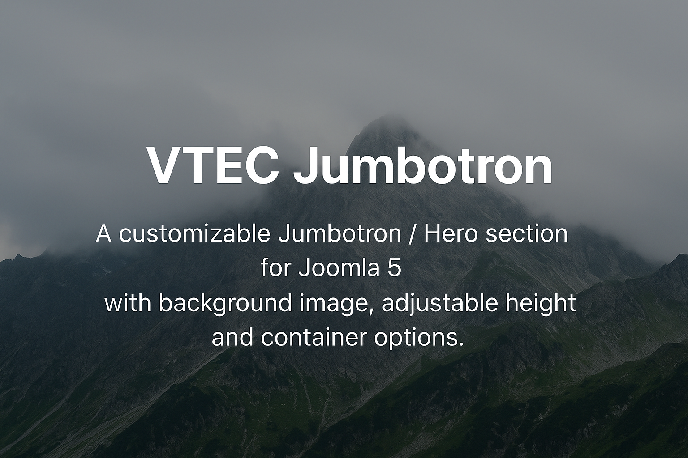

# VTEC Jumbotron5 Module for Joomla 5

A Joomla 5 frontend module that provides a customizable **Jumbotron / Hero section** with background image, adjustable height, and container options.  
The module also includes a Bootstrap check to ensure proper rendering.

---

## ✨ Features
- Selectable **background image**
- Adjustable **height** (e.g. `400px`, `60vh`)
- Choose between **container** and **container-fluid**
- Editable **content** area (supports HTML and text)
- **Bootstrap check** (none, console warning, browser alert)
- Overlay effect for better text readability

---

## 📥 Installation
1. Download the ZIP package:  
   `mod_vtec-jumbotron5.zip`
2. Go to Joomla Backend → **System → Install → Extensions**
3. Upload and install the ZIP package
4. Create a new module: **Content → Modules → New → VTEC Jumbotron5**
5. Configure the options:
   - Select background image
   - Set height
   - Choose container type
   - Add content
   - Configure Bootstrap check
6. Assign the module to a template position (e.g. `banner`, `top-a`)

---

## 📸 Example Frontend

---

## ⚠️ Requirements
- Joomla 5.x
- Bootstrap 5 enabled in your template

---

## 📜 License
This project is licensed under the **GPL-3.0 License** – you are free to use, modify, and distribute it under the terms of the GNU General Public License v3.0.

---

# 🇩🇪 VTEC Jumbotron5 Modul für Joomla 5

Ein Joomla 5 Frontend-Modul, das einen anpassbaren **Jumbotron / Hero-Bereich** bereitstellt, mit Hintergrundbild, einstellbarer Höhe und Container-Optionen.  
Das Modul enthält außerdem eine Bootstrap-Prüfung, um die korrekte Darstellung sicherzustellen.

---

## ✨ Funktionen
- Wählbares **Hintergrundbild**
- Einstellbare **Höhe** (z. B. `400px`, `60vh`)
- Auswahl zwischen **Container** und **Container-Fluid**
- Bearbeitbarer **Inhaltsbereich** (unterstützt HTML und Text)
- **Bootstrap-Prüfung** (keine, Konsole-Warnung, Browser-Alert)
- Overlay-Effekt für bessere Textlesbarkeit

---

## 📥 Installation
1. ZIP-Paket herunterladen:  
   `mod_vtec-jumbotron5.zip`
2. Joomla Backend → **System → Installieren → Erweiterungen**
3. ZIP-Paket hochladen und installieren
4. Neues Modul erstellen: **Inhalt → Module → Neu → VTEC Jumbotron5**
5. Optionen konfigurieren:
   - Hintergrundbild auswählen
   - Höhe festlegen
   - Container-Typ wählen
   - Inhalt hinzufügen
   - Bootstrap-Prüfung einstellen
6. Modul einer Template-Position zuweisen (z. B. `banner`, `top-a`)

---

## 📸 Beispiel Frontend

---

## ⚠️ Voraussetzungen
- Joomla 5.x
- Bootstrap 5 im Template aktiviert

---

## 📜 Lizenz
Dieses Projekt steht unter der **GPL-3.0 Lizenz** – frei verwendbar, anpassbar und weiterverteilbar gemäß den Bedingungen der GNU General Public License v3.0.
